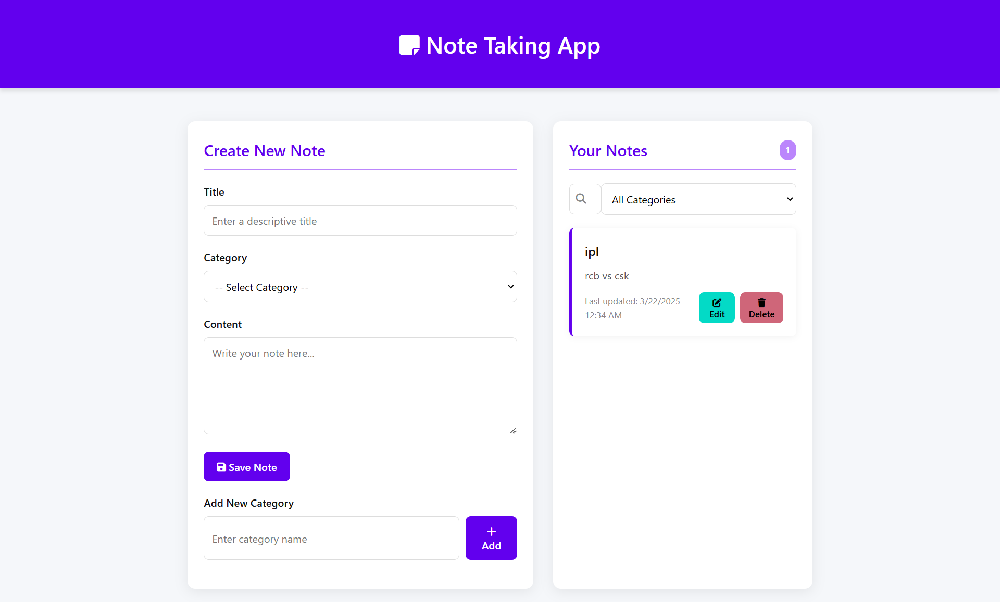

# Note Taking App


A modern, responsive note-taking application with category management, built with Node.js, Express, and Prisma ORM.

## ✨ Features

- 📝 Create, read, update, and delete notes
- 🏷️ Organize notes with categories
- 🔍 Search and filter functionality
- 💾 Persistent storage with SQLite database
- 🎨 Modern, vibrant UI with animations
- 📱 Responsive design for all devices
- 🌙 Dark mode support
- 🖋️ Rich text editor for note content

## 📸 Screenshots

**LANDING PAGE** :



**PRISMA STUDIO** :


## 🚀 Tech Stack

- **Frontend**: HTML5, CSS3, JavaScript (ES6+)
- **Backend**: Node.js, Express.js
- **Database**: SQLite
- **ORM**: Prisma
- **Styling**: Custom CSS with CSS variables

## 📋 Prerequisites

- Node.js (v14 or higher)
- npm (v6 or higher)
```

## 💻 Prisma Implementation

This project leverages Prisma ORM for database operations, providing type-safe database access with excellent developer experience.

### Database Schema

The Prisma schema defines two main models:

```prisma
// prisma/schema.prisma
model Category {
  id    Int     @id @default(autoincrement())
  name  String  @unique
  notes Note[]
}

model Note {
  id         Int       @id @default(autoincrement())
  title      String
  content    String
  createdAt  DateTime  @default(now())
  updatedAt  DateTime  @updatedAt
  categoryId Int?
  category   Category? @relation(fields: [categoryId], references: [id])
}
```

### Key Prisma Features Used

- **Migrations**: Automatic schema migrations with `prisma migrate`
- **Relations**: One-to-many relationship between categories and notes
- **CRUD Operations**: Full create, read, update, delete functionality
- **Filtering**: Advanced filtering capabilities for notes and categories
- **Transactions**: Ensuring data integrity with Prisma transactions
- **Type Safety**: Leveraging TypeScript integration for type-safe queries

### Example Prisma Query

```javascript
// Get all notes with their categories
const notes = await prisma.note.findMany({
  orderBy: {
    updatedAt: 'desc',
  },
  include: {
    category: true,
  },
});
```

## 🌟 API Endpoints

### Notes

- `GET /api/notes` - Get all notes
- `GET /api/notes/:id` - Get a specific note
- `POST /api/notes` - Create a new note
- `PUT /api/notes/:id` - Update a note
- `DELETE /api/notes/:id` - Delete a note

### Categories

- `GET /api/categories` - Get all categories
- `POST /api/categories` - Create a new category

## 🎯 Future Enhancements

- User authentication and authorization
- Cloud synchronization
- Tagging system
- Collaborative editing
- Mobile application

## 🤝 Contributing

Contributions are welcome! Please feel free to submit a Pull Request.

1. Fork the repository
2. Create your feature branch (`git checkout -b feature/amazing-feature`)
3. Commit your changes (`git commit -m 'Add some amazing feature'`)
4. Push to the branch (`git push origin feature/amazing-feature`)
5. Open a Pull Request

## 📜 License

This project is licensed under the MIT License - see the LICENSE file for details.

